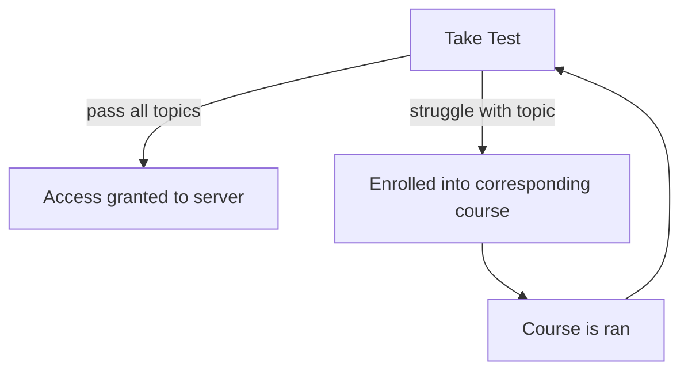

# Omics Server Training

This repository details many aspects of the expected training for the omics
servers (pigeon and Manny) such as:

- Plans for training
- Learning objectives
- 'Lesson plan' proposals
    - These don't need to be followed by the instructor per se, they are only
    given to offer ideas to help achieve the learning objectives

## Topics

Users on shared high performance servers are generally expected to have
suitable knowledge in the following subject areas:

- Basic GNU/linux knowledge
- Shell scripting
- Version control systems
- Data management
- Basic Security
- Dependency management systems

Optionally users could benefit from:

- Critical thinking and debugging skills
- Reproducible programming skills
- Program optimisation skills

All of the above topics are covered in this repository in separate directories
under the same (or shortened) names.

## Pipeline

Not every user will require training in the subject areas lined out in
[topics](#topics) as they are well acquainted with them from use with other HPC
servers. As such training will only need to be delivered to those that truly
need (or want) it. The simplest way to find out who needs what is through a
questionnaire. A form has been created that tests the core subject areas listed
in [topics](#topics) that will test users on these skills. In the event any
gaps exist in the user's skillset, they will be enrolled onto the corresponding
course to help fill that gap.

The full pipeline for a potential user would therefore be:

Ideally, the questionnaire doesn't need to be taken more than once. If a
particular user is really struggling with some particular topic, 1-1 sessions
might be a possible way forward.

It should be noted that this questionnaire mentioned is not filled with
'gotchas', but instead is designed to indicate a user's comfortability in the
subject area. To achieve this, the questionnaire will:

- Mainly consist of open ended questions (so as to discourage guessing)
- Clearly state that "I don't know" is a valid answer (also discouraging
guessing)
- Encourage open book (So understanding can be measured over remembering)
    - Generative AI should be discouraged however, users should be able to
    solve problems with at least a little bit of thought. Otherwise the
    training is useless.

## Onboarding

The process set out in [pipeline](#pipeline) might start to break down when
being applied to an onboarding process. It is probably a waste of time to be
delivering all of this training to each new employee/student for every new
starter individually. Ideally onboarding can be done in groups (in general
PhD students seem to come in groups), if not onboarding may have to wait until
enough participant slots can be filled.

The above will be less of a problem if more teams are involved in the training
process (as it will be less likely only a single person needs to be trained).

## Participant availability

We are all busy people, it might be rather difficult to get multiple people in
the same room at the same time for training.

This can be somewhat mitigated by delivering content in a hybrid setting.
However, collaborative tasks will likely suffer from this decision and a helper
will probably be required to assist with those online.

Another method to mitigate this issue is through promoting resources that
achieve the same learning objectives set out. CFRR courses aren't very
plentiful, but should still be encouraged (each course also comes with well
structured course notes). There are also other resources out there, for example
`git` probably has 1000s of courses online and the 
[command challenge](www.commandchallenge.com) is an excellent way of becoming
proficient with bash. Of course we also have our own set of documentation that
potential participants can be pointed in the direction of.

